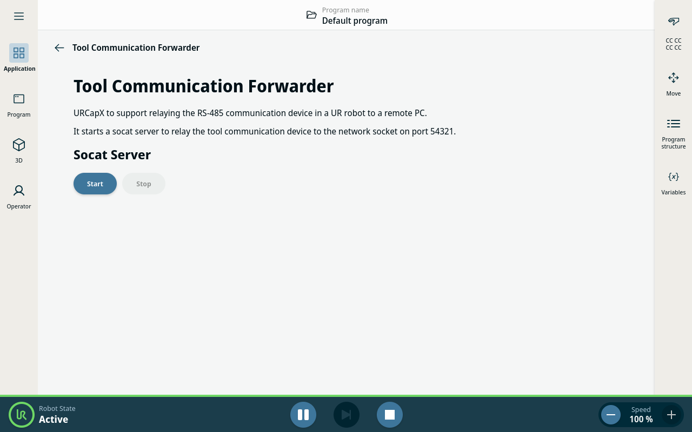
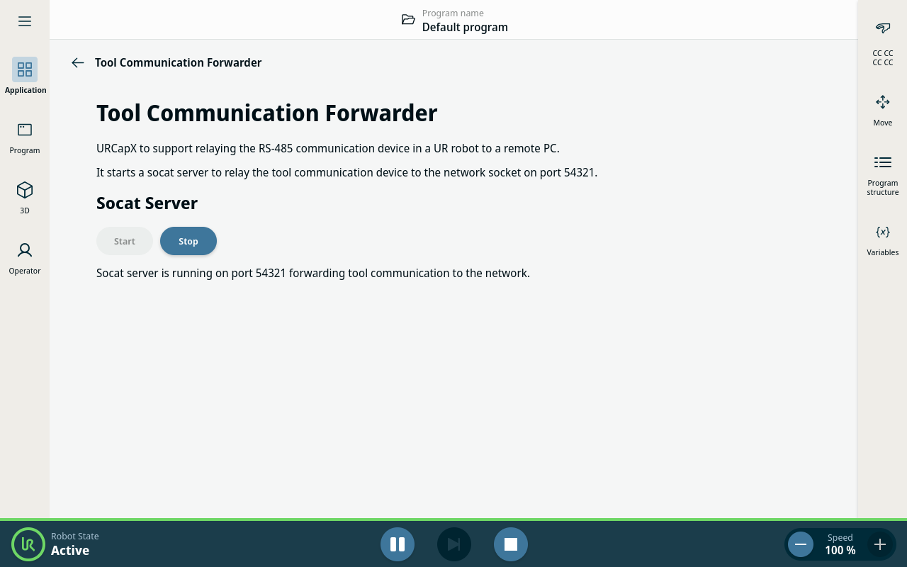

# Tool Communication forwarding URCapX

> [!NOTE]
> This is the PolyScope X version of the Tool Communication forwarding URCap. For the PolyScope 5
> version, please see [Universal_Robots_ToolComm_Forwarder_URCap](https://github.com/UniversalRobots/Universal_Robots_ToolComm_Forwarder_URCap).

This URCapX allows forwarding the serial communication device from the robot's tool flange to a TCP
port. This way, external PCs can communicate with tools connected to the robot's tool flange as if
the device was connected directly to the remote PC.

For this to work, the external PC will have to run `socat` to map the TCP port to a local serial
device.

For example, a robot with IP address `192.168.56.101` could be accessed with the following `socat`
command:
```
socat pty,link=/tmp/ttyUR,raw,ignoreeof,waitslave tcp:192.168.56.101:54321
```

## Install on a robot

To install the URCapX on a robot, you'll need to download the latest version from the [releases
page](https://github.com/UniversalRobots/Universal_Robots_ToolComm_Forwarder_URCapX/releases). Pick
the `tool-comm-forwarder-x.y.z.urcapx ` file and copy it to a USB stick. Plug that USB stick into the
robot's teach pendant and install the URCapX as usual. For usage with ROS, please see [the tool
communication setup
guide](https://docs.universal-robots.com/Universal_Robots_ROS_Documentation/doc/ur_robot_driver/ur_robot_driver/doc/setup_tool_communication.html)
for more information.


> [!WARNING]
> The ttyTool is considered a shared resource. Currently, it's up to the user to ensure that no two
> URCapX are trying to access the ttyTool at the same time. This could lead to unexpected behavior.
> See the [URCapX SDK
> documentation](https://docs.universal-robots.com/PolyScopeX_SDK_Documentation/build/SDK-v0.18/HowToGuides/tool-connector.html#special-considerations)
> for more information.

### Activate tool forwarding

> [!IMPORTANT]
> In contrast to the PolyScope 5 version, tool forwarding has to be explicitly enabled in the
> applications settings.
> If you have installed the URCapX and you get a "Connection refused" error when attempting to
> remotely connect to the tool, it could be that it is inactive.

To activate tool forwarding go to the "Application screen" and scroll down to the "URCaps" section.
There, select the Tool Communication Forwarder. By default, it is inactive and can be activated by
pressing the "Start" button.

<table>
  <tr>
    <td><a href="doc/resources/tool_forward_inactive.png"></a></td>
    <td><a href="doc/resources/tool_forward_active.png"></a></td>
  </tr>
  <tr>
    <td>Tool forwarding is inactive. Activate it by pressing "Start"</td>
    <td>Tool forwarding is active. Deactivate it by pressing "Stop"</td>
  </tr>
</table>

### Robot setup

To use the forwarded ttyTool, you will need to enable tool communication on the robot. This can be
done by using the URScript functions
[`set_tool_communication`](https://www.universal-robots.com/manuals/EN/HTML/SW10_11/Content/prod-scriptmanual/all_scripts/set_tool_communication.htm)
and
[`set_tool_voltage`](https://www.universal-robots.com/manuals/EN/HTML/SW10_11/Content/prod-scriptmanual/all_scripts/set_tool_voltage_voltage.htm).

For example, you can add a Script code program node to the program with the following code:

```
set_tool_voltage(24)
set_tool_communication(True, 115200, 0, 1, 1.5, 3.5)
```


## Build and Deploy Sample

To build and deploy this sample, use the commands below. A rebuild of the project is required to see any changes made
to the source code. If you are deploying the URCap to URSim, ensure that you have started the simulator.

### Dependencies

Run this command to install the dependencies of the project.

```shell
npm install
```

### Build

Run this command to build the contribution type.

```shell
npm run build
```

### Installation

Run this command to install the built URCap to the simulator.

```shell
npm run install-urcap
```

Run this command to install the built URCap to the robot.

```shell
npm run install-urcap -- --host <robot_ip_address>
````
